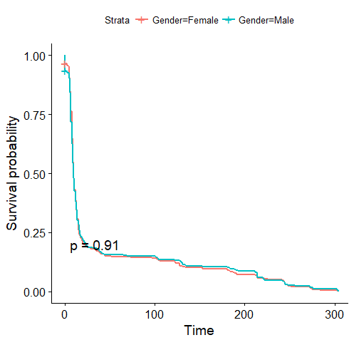

# Survival_Analysis
Investigating Mortality Using Obituary Data
Survival Analysis

The survival plot demonstrates the probability of survival among the gender male and female. 
The event under study is the actual recording of death with time being the duration between death and burial. As such the plot demonstrates a change in risk across the two groups in time. 
Using p <0.05 for testing statistical significance, then none of the genders investigated were significantly superior. Nonetheless, the female appear superior in survival in the early durations. 

